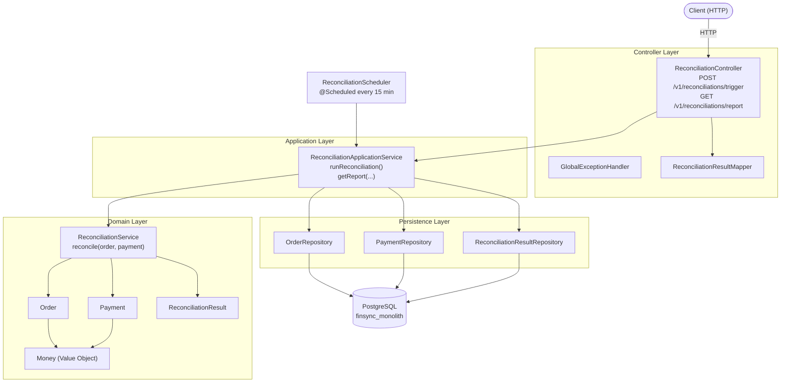
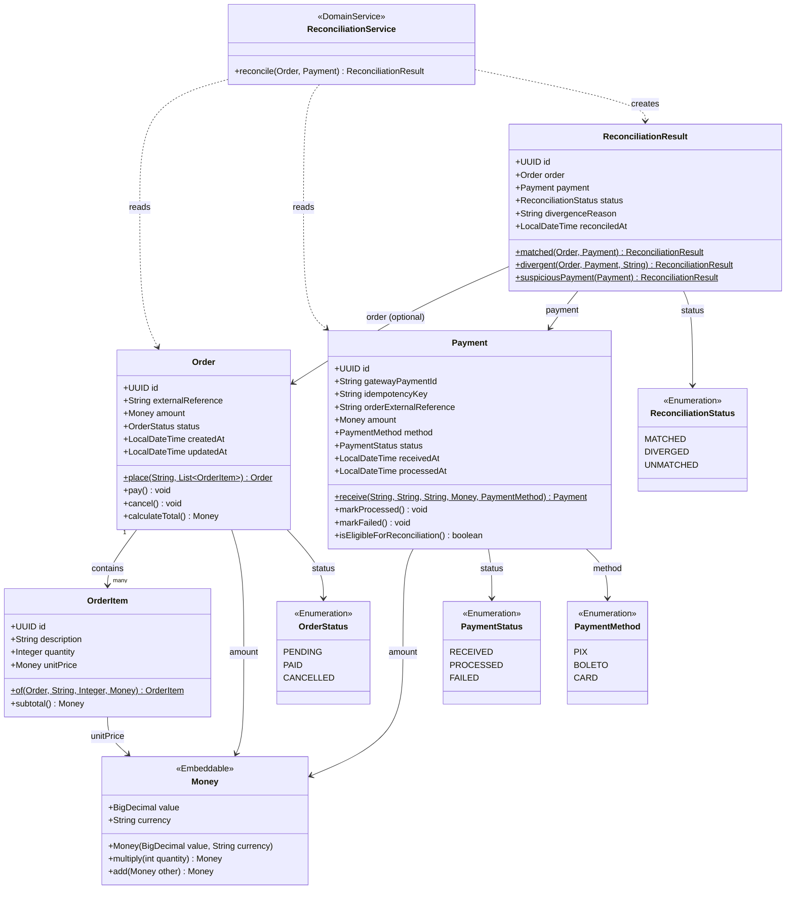
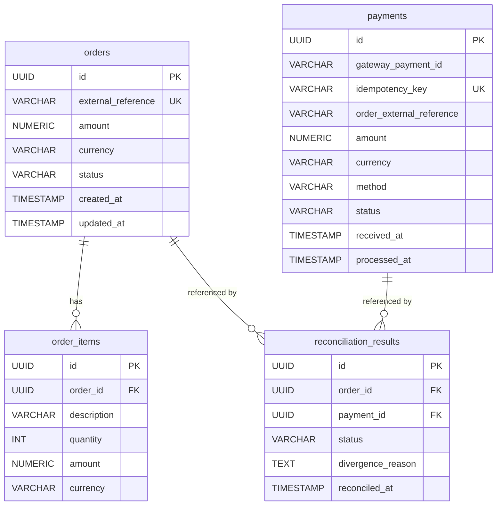
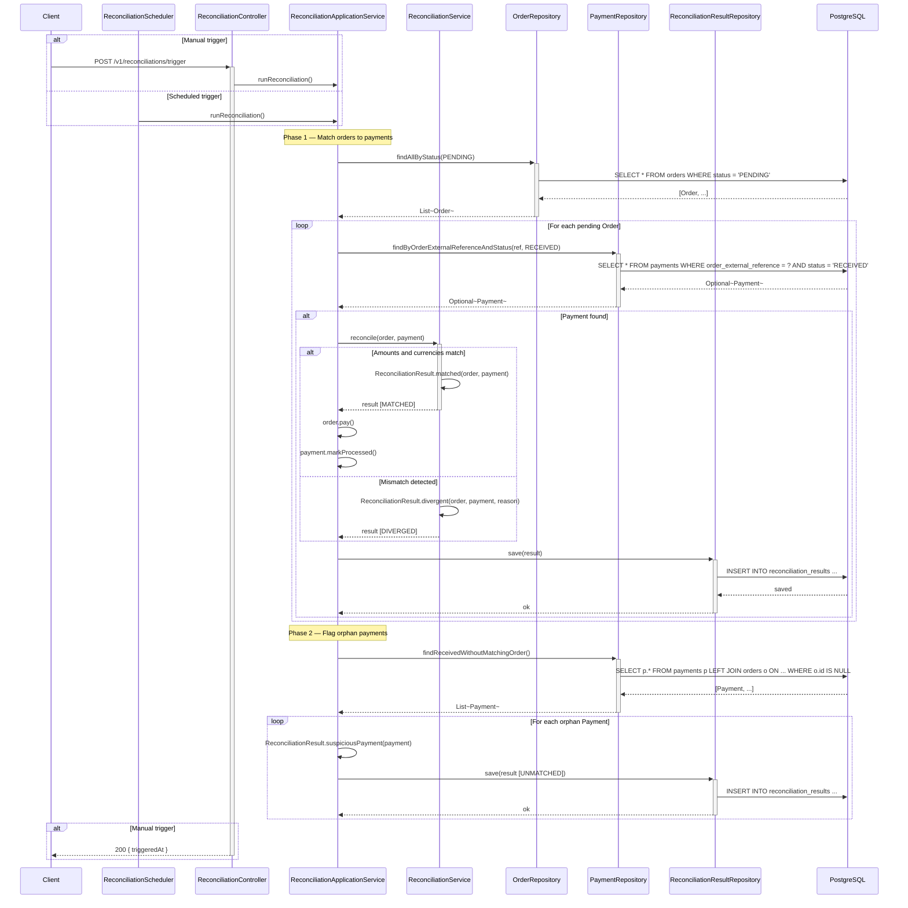
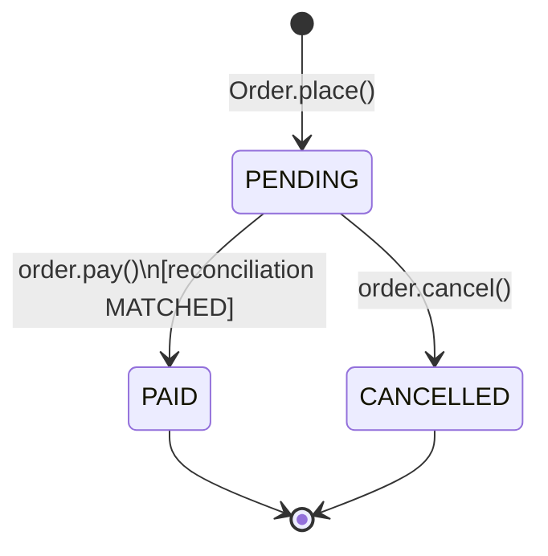
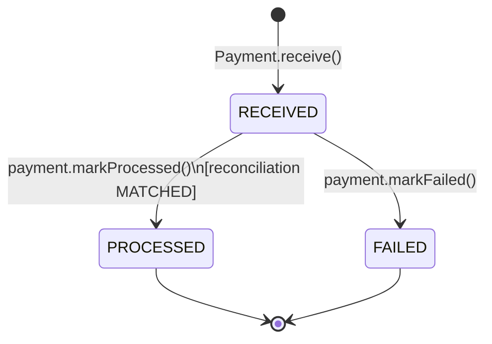
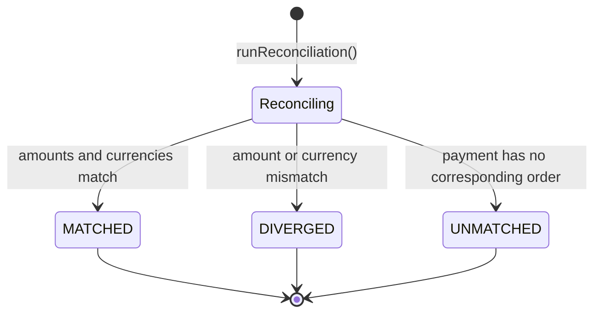

# Architecture

## Table of Contents

1. [System Overview](#1-system-overview)
2. [Domain Model](#2-domain-model)
3. [Database Schema](#3-database-schema)
4. [Reconciliation Flow](#4-reconciliation-flow)
5. [State Machines](#5-state-machines)

---

## 1. System Overview

High-level view of the application layers and their dependencies.

---

## 2. Domain Model

Class diagram showing all domain aggregates, value objects, enums, and their relationships.

---

## 3. Database Schema

Entity-relationship diagram showing all tables and constraints.

---

## 4. Reconciliation Flow

Sequence diagram of both the scheduled and manual reconciliation triggers.

---

## 5. State Machines

### Order lifecycle

### Payment lifecycle

### Reconciliation result outcomes

